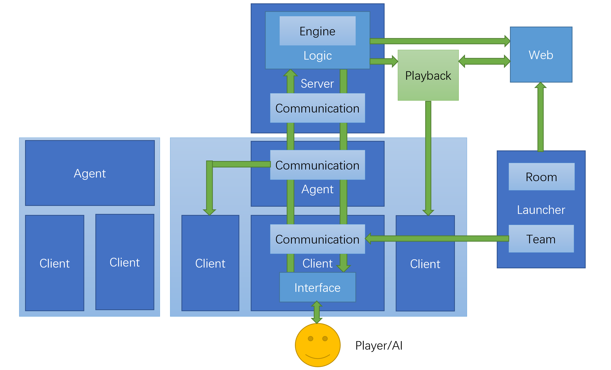

# THUAI4
THUAI4 原电子系第22届队式程序设计大赛

## 赛题简介

赛题灵感来自《喷射战士》，核心玩法为玩家通过攻击/使用道具来对地图染色/对敌人造成伤害。人物死亡后可以复活。在规定时间内染色面积更大的队伍即为胜者。

## 框架简介

暂定架构如下：

C/S架构，实时游戏，同时支持人/AI，支持多种部署方式（局域网、服务器、本地）。

## 仓库说明

本仓库为所有开发工作共用仓库，请勿上传大文件，每个目录均已配置好Visual Studio开发时的`.gitignore`忽略规则，请根据需要自行修改，不要修改主目录下的`.gitignore`忽略规则。请各开发组在开发中维护好自己负责子目录内的`README.md`，记录设计思路、开发进度等信息（可参照示例），方便大家了解当前工作。

#### 目录分配

- CAPI：选手接口，生成可执行文件
- communication：通信组件，生成`.NET Standard 2.0`，` .NET Core 3.1`类库与`.Net Core 3.1`可执行文件（Agent）
- config：配置文件，主要是游戏中数值等信息
- dependency：需要使用的各种依赖与proto文件
- installer：下载/更新器，生成Windows GUI程序
- interaction：玩家交互，生成Unity程序
- launcher：游戏启动器，生成Windows GUI程序。
- logic：游戏逻辑，生成`.Net Core 3.1`可执行文件
- playback：回放组件，生成`.NET Standard 2.0`和` .NET Core 3.1`类库
- resource：用于存放主目录下markdown文件的图片等

#### 分支

- master：工作较稳定的版本或阶段性成果，需要2 reviewers
- dev：各个小组开发工作最新进展，需要1 reviewer

## 开发规则

使用Git和GitHub进行版本控制，开发组成员应遵守如下开发规则：

1. Fork
2. 创建功能分支
3. 开发后Push到个人仓库
4. Pull Request
5. 删除功能分支
6. Pull eesast仓库到个人仓库

其中commit与Pull Request中的信息应认真书写，写明完成的功能。eesast仓库分为master与dev两个分支，dev分支用于日常开发，master分支用于保存阶段性成果与稳定版本，dev分支只要一个reviewer即可merge，建议同小组同学互相review，master分支需要负责人操作。

## 其他注意事项
- 注意代码可读性，注释要让他人能看懂
- 适时整理开发文档，对接文档等内部资料
- 注意做好部会记录，记录各种饼和锅，及时整理赛题规则，以免事后忘记
- 开发组在赛事开始前准备好规则手册，C++API手册提供给选手
- 开发过程中注意各部分的组件化，避免不同部分之间的耦合。便于下一届复用。
- 注意跨平台的问题
- 尽量不要上传大文件
- 多了解其他小组的工作

## 开发组成员

逻辑组：刘雪枫，李晨阳，谢童欣

交互组：张书源，潘修睿

通信组：何思成，李泽润，刘芳甫

赛事组：史益鸣，叶召城

端茶倒水：李翔宇