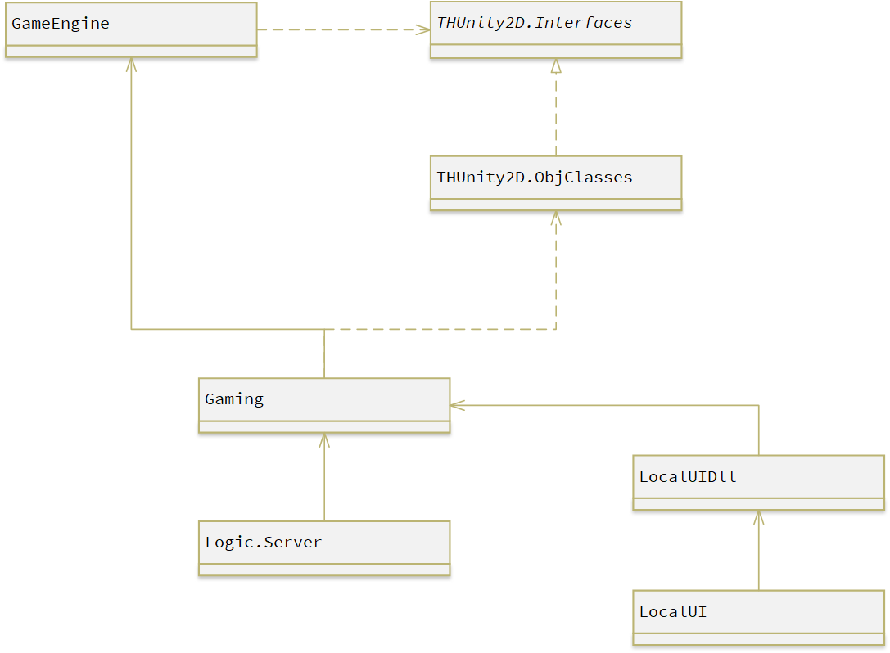

# docs  

---

## Server  

Server 为游戏底层逻辑与服务器代码，各个项目的功能如下：  

+ 一、游戏引擎部分  

  + `THUnity2D.Utility`  

    + 通用工具，用于进行一些计算与调试  

  + `THUnity2D.Interfaces`  

    提供给游戏通用引擎定义的接口，即一个游戏对象需要满足的条件  

    + `IGameObj`：一切游戏对象满足的共有接口  
    + `IMovable`：可移动对象满足的接口  
    + `ICharacter`：游戏人物满足的接口  
    + `IObj`：游戏物体满足的接口  
    + `IOutOfBoundBlock`：越界方块满足的接口，用于简化越界处理  
    + `ITimer`：游戏定时器满足的接口  
    + `IMap`：游戏地图需满足的接口  

  + `GameEngine`   

    游戏通用引擎，用于进行人物行走等多种行为  

    + `CollisionChecker`：碰撞引擎，用于碰撞检测  
    + `MoveEngine`：移动引擎，用于实现物体移动或人物行走  

+ 二、游戏逻辑部分  

  + `THUnity2D.Constant.cs`  

    记录游戏的各个常量  

  + `THUnity2D.ObjClasses`  

    游戏对象类  

    + `GameObject`：一切游戏对象的基类  
    + `Character`：人物基类  
      + `Character.GetChatacter`：人物工厂方法  
    + `Character.BuffManeger`：控制人物 buff 效果 
    + `Character0`~`Character6`：各个具体人物类（不同的职业）  
    + `Obj`：游戏物体  
    + `OutOfBoundBlock`：越界方块，用于简化对越界情况的处理  
    + `BirthPoint`：出生点类  
    + `Prop`：道具基类  
    + 各种具体道具类  
    + `Wall`：墙体  
    + `Bullet`：子弹基类  
    + `Bullet0`~`Bullet6`：各种具体子弹类  
    + `Team`：队伍类  

  + `Gaming`  

    + `Game`：游戏主逻辑类，对各个操作做出响应  
    + `Game.AttackManager`：负责作出对人物攻击的响应  
    + `Game.MoveManager`：负责作出对人物移动的响应  
    + `Game.PropManager`：负责做出对人物捡、使用、扔出道具的响应以及道具的产生等  

  + `Logic.Server`  

    + `Program`：程序入口  
    + `ArgumentOptions`：用于定义接收的命令行参数  
    + `CopyInfo`：用于将游戏内的对象转换为通信信息用于发送  
    + `ConvertTool`：用于将游戏内使用的类型等信息转换成通信所用信息  
    + `HttpSender`：用于积分天梯上与网站进行通信  
    + `ServerBase`：游戏服务器（Server）逻辑的公共基类  
    + `GameServer`：积分天梯所用的游戏 Server  
    + `RequestOnlyServer`：不进行游戏，只负责给对战网站发送信息，供网站组 Debug 使用，无实际作用  
    + `PlayBackServer`：用于观看游戏回放的 Server  
    + `FinalGameServer`：决赛使用的 Server  
    + `CheatServer`：开启了作弊模式的 Server，赛后供选手娱乐使用  
    + `ServerFactory`：Server 工厂，用于根据命令行输入产生不同的 Server  
    
  + `test`  

    此项目用于最初游戏逻辑开发时进行调试，将游戏当前状况转为文字输出到控制台上以观测可能产生的 bug。  

  + `LocalUIDll` 与 `LocalUI`  

    此两个项目用于最初游戏逻辑开发时进行进一步调试，以检测代码中更多的 bug。但由于本人当初并不会使用 C# 做图形界面，因此使用了 C++/CLI 快速做出了一个简易的图形界面。但是希望今后的开发者贸然不要学习这种做法，尽量全部使用 C# 实现。  

本部分使用的第三方库如下：  

+ `FrameRateTask`：第三方开源库，用于稳定游戏刷新与通信等定时事件的帧率，缓解帧率不稳的问题，并根据实际情况对卡顿的现象做出不同的反应。开源库地址：https://github.com/Timothy-LiuXuefeng/FrameRateTask。作者：Timothy-LiuXuefeng（其实就是我自己 Ohhhhhhh）  
+ `Google.Protobuf`：Nuget 包，用于通信  
+ `CommandLineParser`：Nuget 包，用于解析命令行  
+ `Newtonsoft.Json`：Nuget 包，用于快速将游戏结果生成 json 文件。此 Nuget 包的使用是历史遗留问题，新的项目建议使用 .NET Core 3.0 增加的 `System.Text.Json` 中的 `JsonSerializer` 类的 `Serialize` 方法来完成此工作：https://docs.microsoft.com/zh-cn/dotnet/api/system.text.json.jsonserializer.serialize?view=net-5.0#System_Text_Json_JsonSerializer_Serialize__1___0_System_Text_Json_JsonSerializerOptions_  

## Client  

项目名称为 `Logic.Client`，用于为选手提供简易的、快速的、方便的显示当前游戏状况的窗口，供选手调试。  

本部分使用的第三方库为 `CommandLineParser`，详情参见 Server 部分的第三方库介绍。  

